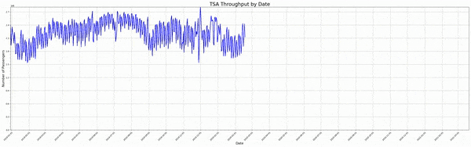

# TsaThroughput

Monitors the TSA Published Statistics on the [FOA Electronic Reading Room](https://www.tsa.gov/foia/readingroom) site. Ths codebase supports the processing of PDF files to JSON and CSV files. With this information, you can see TSA Throughput history. The following animation was created using this data.
See sample input and output files in the [/data](./data) folder.



Eventually this will be automated utilizing the below architecture


## Project Organization

At a high level, the project is organized into 3 main folders:

 * /data - Contains all of the input and output data used in processing. Think of this as the root folder to a local data lake.
 * /doc - Contains all of the documentation artificats. At the momement, the best way of navigating the limited documentation is to start with this README.md file.
 * /src - Contains all of the source files for the project. There are currently 3 subfolders, each of which is a project in its own right.
   * /TsaThroughputApp - A C# .NET Core console app that reads a TSA Throughtput PDF file and outputs a JSON representation. This will eventually be migrated to the "CvtThrougputToJson" functioin as depicted ain the diagram.
   * /TsaThroughputFunctions - A C# .Net Core function app that will contain implementations for the GetThroughputFile and CvtThrougputToJson functions as depicted in the diagram.
   * /tsa_throughput - A python application that converts the .json file to a .csv file. See the [README](src/tsa_throughput/README.md) for more detail.

## Quickstart

### Prerequisites

### One Step Update

If you don't care about the details, and just want to update the data to the latest available file published, navigate to the /scripts folder and issue the following command
```
./updateData.sh <latest filename>

./updateData.sh tsa-throughput-april-19-2020-to-april-25-2020.pdf
```
This will convert the .pdf file to json and then create .csv files and figures based on the latest data.

### A Little More Detail
The *updateData.sh* script makes it easy to just get'er done. It's contains a couple of other scripts to convert from PDF to JSON, and another to build CSV files.
#### Running the TSAThroughputApp - Converting From PDF to JSON

Navigate to the /scripts folder and issue the following command

```
./cvtPdfToJson.sh ../data/tsa-throughput-april-19-2020-to-april-25-2020.pdf
```

#### Converting from JSON to CSV

Navigate to the /scripts folder and issue the following command

```
./cvtJsonToCsv.sh
```

The above command will process all of the files in the /data/raw/tsa/throughput folder and filter based on -a AIRPORTCODE. If you don't use the -a option, it will process all airports.


## Design Decisions
  * 2021-06-17 - GetTsaThroughputFile Function
    * Decided to write PDF File to Blob Storage instead of Storage Queue. Size of a message in a queue is limited to 64K, far less than the size of a TSA Throughput file.
    * Updated [System Component Diagram](doc/SystemComponentDiagram.png) to reflect the change.