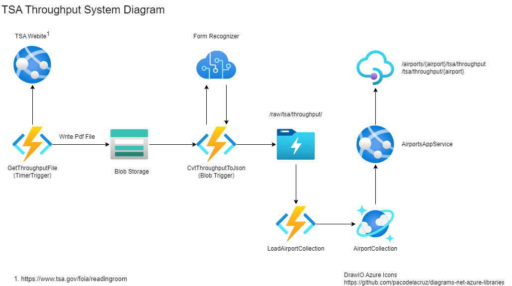

# TsaThroughput

Monitors the TSA Published Statistics on the [FOA Electronic Reading Room](https://www.tsa.gov/foia/readingroom) site. Downloads new PDF files and Saves as .json

See sample input and output files in the [/data](./data) folder.

Eventually this will be automated utilizing the below architecture

## Project Organization

At a high level, the project is organized into 3 main folders:

  1. /data - Contains all of the input and output data used in processing. Think of this as the root folder to a local data lake.
  2. /doc - Contains all of the documentation artificats. At the momement, the best way of navigating the limited documentation is to start with this README.md file.
  3. /src - Contains all of the source files for the project. There are currently 3 subfolders, each of which is a project in its own right.
    1. /TsaThroughputApp - A C# .NET Core console app that reads a TSA Throughtput PDF file and outputs a JSON representation. This will eventually be migrated to the "CvtThrougputToJson" functioin as depicted ain the diagram.
    1. /TsaThroughputFunctions - A C# .Net Core function app that will contain implementations for the GetThroughputFile and CvtThrougputToJson functions as depicted in the diagram.
    1. /tsa_throughput - A python application that converts the .json file to a .csv file. See the [README](src/tsa_throughput/README.md) for more detail.
