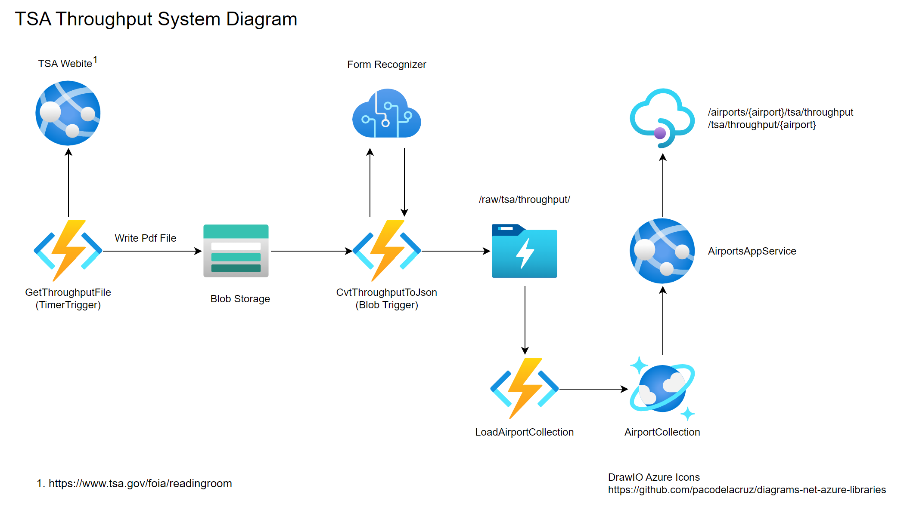

# TsaThroughput

Monitors the TSA Published Statistics on the [FOA Electronic Reading Room](https://www.tsa.gov/foia/readingroom) site. Downloads new PDF files and Saves as .json

See sample input and output files in the [/data](./data) folder.

Eventually this will be automated utilizing the below architecture


## Project Organization

At a high level, the project is organized into 3 main folders:

 * /data - Contains all of the input and output data used in processing. Think of this as the root folder to a local data lake.
 * /doc - Contains all of the documentation artificats. At the momement, the best way of navigating the limited documentation is to start with this README.md file.
 * /src - Contains all of the source files for the project. There are currently 3 subfolders, each of which is a project in its own right.
   * /TsaThroughputApp - A C# .NET Core console app that reads a TSA Throughtput PDF file and outputs a JSON representation. This will eventually be migrated to the "CvtThrougputToJson" functioin as depicted ain the diagram.
   * /TsaThroughputFunctions - A C# .Net Core function app that will contain implementations for the GetThroughputFile and CvtThrougputToJson functions as depicted in the diagram.
   * /tsa_throughput - A python application that converts the .json file to a .csv file. See the [README](src/tsa_throughput/README.md) for more detail.

## Quickstart

### Prerequisites

### Running the TSAThroughputApp - Converting From PDF to JSON

Navigate to the /src/TsaThroughputApp folder and issue the following command

```
dotnet run -- ../../data/tsa-throughput-february-28-2021-to-march-6-2021.pdf ../../data/raw/tsa/throughput/tsa-throughput-february-28-2021-to-march-6-2021.json
```

### Converting from JSON to CSV

Navigate to the /src/tsa_throughput folder and issue the following command

```
python make_airport_dataset.py dir -d ../../data/raw/tsa/throughput -a SEA -o ../../data/processed/tsa/throughput 
```

The above command will process all of the files in the /data/raw/tsa/throughput folder and filter based on -a AIRPORTCODE. If you don't use the -a option, it will process all airports.